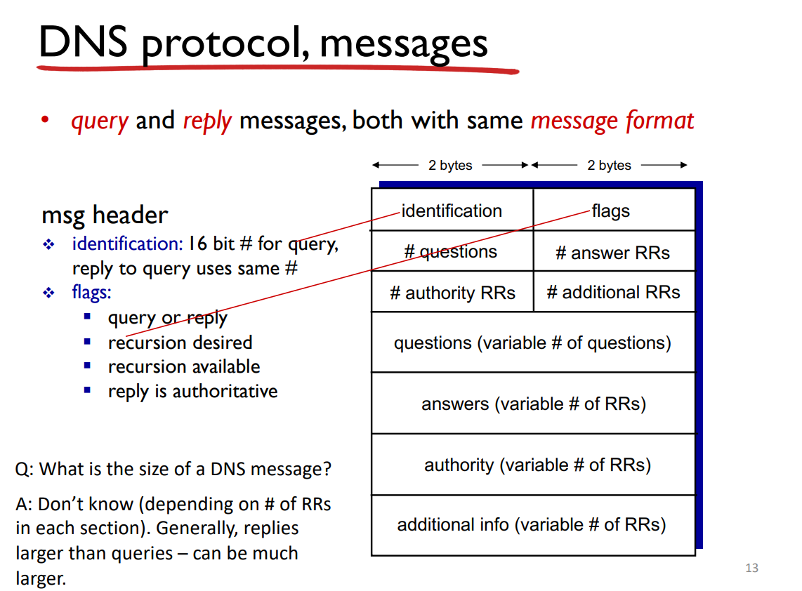
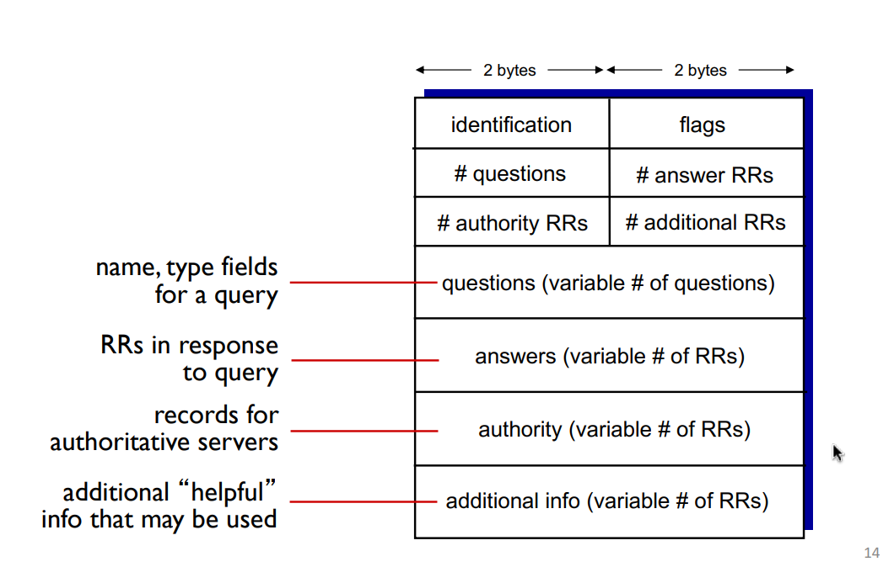

Translate from name to IPv4 (32 bits). Hierarchical, short prefixes are used only to decide the next hop - much smaller routing table

Internet hosts, routers are identified by their 32 bit IPv4 address. Their names "www.google.com" are only used by humans.

## DNS

1. Distributed database of IPs - implemented in hierarchy of many name servers
2. Application layer protocol - hosts, name servers communicate to resolve names (address/name translation). This is a core interenet function, implemented as app layer protocol. Complexity at network's edge

## Functions of DNS:

1. name to IP (Protect domains, strong modularity, fault isolation. cf. processes), allows servers to move w/o affecting end users (late binding)
2. Distributed (hierarchical) servers: scalable
3. mail server aliasing
4. host aliasing - many names corresp. one IP (many to one mapping)
5. load distribution - replicated web services, many IPs corresp. to one name (one to many mapping)
6. Cost of indirection: Delay, potential poisoning

## Why not centralised?

1. DOES NOT SCALE
2. Bottleneck
3. Single pt of failure
4. distant central database (long delay for lookup)
5. Maintenance (modifying translations)

## Hierarchy

1. Root DNS Server
2. Top Level Domains, (TLD) `com`, `org`, `edu`, `net`... etc. and `sg`, `in`, `jp`... etc.
3. Authoritative DNS: resolving names w/i the organisation.

Local DNS name servers - One for each ISP. When hosts make DNS queries, it is sent to the local DNS server. It maintains a cache of name-address pairs, acts as proxy, queries are forwarded up the heirarchy

query root -> query one of these -> get IP

13 root name "servers" (logical, aka named auth). Worldwide, over 400 physical servers.

1. Iterated queries: Queried server replies with "IDK, but ask this server"
2. Recursive queries: Queried server must return a resolved name, so now IT needs to ask other servers for name-IP map.

Qns:

- Who decides (client/server) iter/recur query?
- Are servers willing to support recur queries?

Once a DNS server learns the name-IP map, it caches. TLD servers are often cached in local servers - root servers not visited. Caches disappear after some time (TTL). Who sets TTLs? If the IP changes, it won't be known internet wide until all TTLs expire

Update/Notify mechanisms proposed IETF standards - RFC 2136

## DNS Resource Records (RR)

### Format

`<name, val, type, ttl>`

1. type = A, name - hostname, val - IP
2. type = CNAME, name - alias for canonical name, val - canonical name
3. type = NS, name - domain, val - hostname of auth name server for this domain
4. type = MX, val - mail server associated with name

### Inserting

1. Register name at DNS registrar, provide name, ip, auth name server (primary/secondary)
2. Add two RRs to TLD, (NS (for auth DNS name server) and A type) and also a type MX RR.

### Attacking

#### DDoS

1. bombard root w/traffic. Ineffective (filtering, local caches allow root bypass)
2. bombard TLD. Potentially more dangerous
3. Send queries with spoofed source address, targete IP. Requires amplification

#### Redirect

1. MitM
2. DNS poisoning

## Naming Application Endpoints

IP not enough to talk to a specific app on a machine.

Is the IP and pid enough to communicate with a specific process? No, pid too volatile.

- Sockets: door between application process and e2e transport protocol
- Network access: I/O, sockets: special file descriptors
- IP + Port
- Mux at sender (add transport header to data from multiple sockets)
- Demux at receiver (use header to deliver correct data to different sockets)

### UDP

- No handshake (no "connection")
- IP + Port on each packet
- Lossy/Out of order
- Unreliable, but real time

### TCP

- Socket: 4-tuple (source.ip, source.port, dest.ip, dest.port)
- Demux: All 4 values used to determine destination
- Concurrent TCP sockets
- Connection oriented
- handshake/setup, reliability, flow control, congestion control.
- Client contacts server, server must be listening for connections
- clients contact server by creating TCP socket specifying IP/Port of server. Client TCP establishes connection to server TCP
- When contacted by client, create new TCP socket to talk to client. Multiple clients support, source ip/port used to demux
- Reliable, in-order byte stream (pipe)

#### Web and HTTP: TCP servers
HTTP - web's application layer protocol

- Client initiates TCP connection to server, server accepts
- HTTP messages exchanged b/n client and server
- HTTP is stateless. No need to maintain history/cleanup
- Cookies can be added to keep state

1. Non-persistent HTTP
    - At most one object sent over TCP connection, connection then closed
    - Multiple objects = multiple connections
    - client: connection tcp init (syn)
    - server: tcp connection accept, notify (syn + ack)
    - client: request message (ack + piggy backed req)
    - server: response message, close connection (ack + piggy backed res)
    - client: receives response. repeat process for any sub-ref-ed objs
    - Time: 2*RTT + file transmission time 

2. Persistent HTTP
    - Server leaves connection open
    - Multiple objects can be sent over one connection

