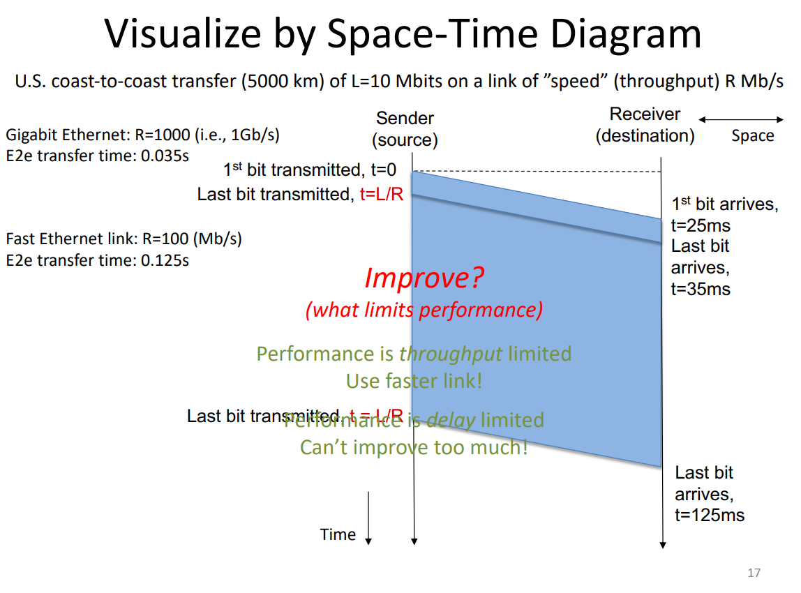

## Packet Delay & Loss

If the packet arrival rate > output link rate, packets queue in a packet buffer to wait to be linked. If there is no space in the buffer, the packets are dropped. Priority packet dropping. Dropped packets may or may not be re-transmitted by previous node. Loss is random - each link has an average probability for loss. Packets may also be dropped due to errors (wifi)

Four sources of packet delay:

1. Nodal Processing: checksum/multiplexing (typically < ms)
2. Queuing: depends on utilisation
3. Transmission: Time to push packet from router buffers to link ((bandwidth) bits/s, `size/speed`) link technology
4. Propagation: Time for packet to move from beginning to end of link (`distance/(2/3*c)`)

R: link bandwidth
L: packet size (bits)
a: avg packet arrival rate

La/R average link utilisation.

1. `~0`: small queue delays
2. `~1`: large queue delays
3. `>1`: packets dropped, more work arriving, queue delay infinite!

Queue delay is a convex function of utilisation, assuming random and bursty packet arrival (normal for internet)

In real networks, the full delay will be composed of multiple routers. The average loss rate is the composition of loss rates for multiple routers as well

`Traceroute` is a program that measures the round trip time of 3 packets

### Traceroute

Source sends a series of UDP segments to destination with an unlikely port number

The first set of 3 packets has TTL=1
The next set of 3 packets has TTL=2, and so on.

If the TTL expires before reaching the destination, an ICMP message (type 11 code 0) is sent back to the source by the router where the TTL expired.

Traceroute stops when the UDP segment reaches the host and it replies ICMP "port unreachable" (type 3 code 3), and then the source stops.

### ICMP

`ping` is another useful program.

1. `Traceroute` uses ICMP TTL exceeded and ICMP port unreacahble messages
2. `Ping` uses ICMP echo request/reply messages

These are not critical for normal operation, thus it is possible for them to be disabled (hence the `*` in some output lines) or misconfigured or bugged

### Throughput

Rate at which bits can be transferred between the sender and the receiver.

ONE link between all the routers in the connection is the bottleneck for the speed

## Space Time Diagram

If the diagram is blue part dominated, it is throughput limited (use faster link!). If it is white dominated, it is delay limited (not much scope for improvement)