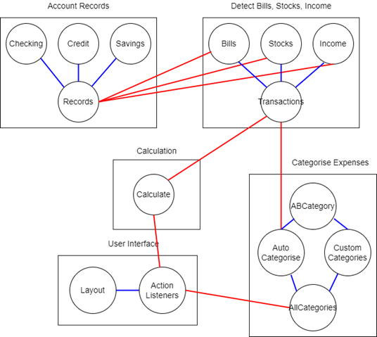

## SWDev Life Cycle

Analysis Diagram


1. Requirements
      1. List candidate requirements
      2. Understand the system context through domain modelling and business modelling
      3. Capturing functional as well as non functional requirements
            1. Functional requirement: A booking system must make the booking if the user has paid for the booking
            2. Non functional requirement: must book w/i 30s
2. Analysis
      1. Understand how requirements interact and what it means for the system
      2. Client might miss out on specifications in the requirement - you need to read between the lines
      3. Developing an internal view of the system
      4. Identifying the analysis classes and their collaborators - place holders of functionality
3. Design
      1. Deciding the collaboration between the components lies at the heart of SW Design
      2. A component fulfils its own responsibility through the code it contians
      3. Components exhcange information through methods
      4. Tech stack
      5. Dividing the system into implementation units
4. Implementation
      1. Programming
      2. Unit testing
      3. Integration testing
      4. Deployment model
5. Testing
      1. Manaul & automated testing
      2. Continuous integration and testing

## SWDev Methods

### Waterfall Model

Linear sequential model of SDLC

- Clearly defined stages, well understood milestones
- Hardly adjustable to new requirements

```
Requirements
    Analysis
        Design
            Implementation
                Test
                    Roll out
```

Work products from each stage are inputs to the next page

Each stage of the life cycle is separate from the others

If the requirements are not stable, this can be a disadvantage, because it means restarting the life cycle if there is a change in the product requirements

### Rapid Prototyping

Make a prototype of your end product ASAP to review w/ customer

1. building of prototypes to clarify requirements and system scope
2. The prototypes, however, should never become the final system
3. Once the requirements have been sort out, the system is built formally

### Iterative and Incremental Development

RADIT, Release, RADIT, Release, ...

Sprints, time boxed development cycles

iterative incremental model: make small steps at each iteration: **wheel comes before car**

### Agile Method

1. **Individual interactions** over processes and tools
2. **Working software** over comprehensive documentation
3. **Customer collaboration** over contract negotiation
4. **Responding to change** over following a plan

12 Agile principles

1. **Customer satisfaction by rapid delivery of useful software**
2. **Welcome changing requirements, even late in development**
3. **Working software is delivered frequently (weeks rather than months)**
4. Close, daily cooperation between business people and developers
5. Projects are built around motivated individuals, who should be trusted
6. Face-to-face conversation is the best form of communication (co-location)
7. **Working software is the principal measure of progress (talk is cheap, show me your code)**
8. Sustainable development, able to maintain a constant pace
9. Continuous attention to technical excellence and good design
10. Simplicity—the art of maximizing the amount of work not done—is essential
11. Self-organizing teams
12. Regular adaptation to changing circumstance

It has high demand on the quality of devs, and its hard to separate responsibilities. Not recommended for team size > 12

### Abstraction

Black box, the process of hiding the implementation details of something and providing the user with just the functionality

### Hierarchy

OOP

### The Software Equation

$(B^{1/3} * Size ) / Productivity = Effort^{1/3} * Time^{4/3}$

$Effort = \left[ \cfrac{Size}{Productivity \times Time^{4/3}} \right]^3 \times B$

