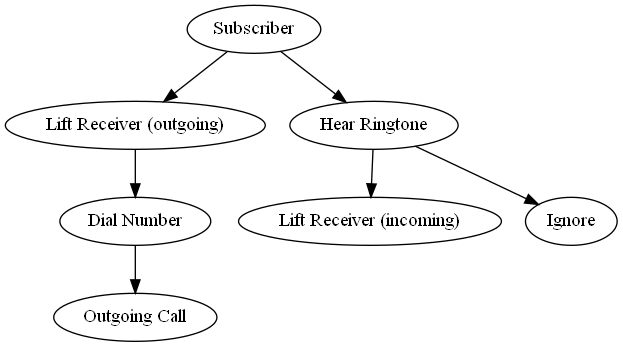

## Modeling Languages

- For docs and communication
- Important Part of any software dev process
- It forms the basis of an iterative design process
- It forms the basis of communication between different parties

### Unified Modelling Language (UML)

1. Use case diagrams
2. Sequence diagrams
3. Class diagrams
4. State diagrams

## Use Case Diagrams

### Roles & Functionality

1. The user can:
   1. li1
   2. li2
2. The admin can:
   1. li1
   2. li2

## Use Case Document

### Format

Name: Name of the use case
Objective: Action of the use case
Actor: Who carries out the action (primary), who is affected by the action (secondary)
Constraints: the formal rules and limitations of a use case, defining what can and cannot be done
Flow: Describe the interactions between the actor(s) and the system clearly enough for an outisder to easily understand
   - The flow of events should represent *what* the system does (not *how*)

### Actor

Each actor has associated use cases that are used to document what the particular actor expects of the system.

Identifying the actors of a system should be done early in the life cycle.

Actors are captured, including
   - Who they repr
   - Why they're needed
   - What interests the actor has in the system
   - Chars of the actor
   - Name
   - Brief description
   - Relationships to use cases

### Constraints

- Pre conditions: xxx thing has already run before yyy thing runs (Create before Edit). These must be observable states, these are not what triggers a use case.
- Post conditions: zzz thing is always true after yyy thing runs (Consistent after Edit). Must be true regardless of the flow
- Invariants: www thing is the same before and after yyy thing runs (ID)

### Flow

- Describe the interaction between the actors and the system clearly
- *What* the system does, not how

1. Basic Flow (Most common path)
2. Alternate Flow (Alternate paths)
3. Exception Flow (When something goes wrong)

- Describes how the use case starts and ends
- What data is exchanged b/n actor and use case
- UI should be left out of the use case
- Flow over functionality When the actor...
- Avoid vague terminology
- Detailed flow (what happens when) - used for test cases

Example:

## Use Case Diagrams

Shows the set of use cases, actors and their relationships. It contains actors, actions/use case, connection between use case/actions.

Use case diagrams represent system functionaltiy, the requirements of the system from <u>the user's perspective</u>

### Actors

Actors are the object that provide or receive information from the system. Primary: proivdes, Secondary: receives

### Use Case

Is a desc of the set of seq of **actions** that the system performs that yields an observable value to the actor. Should begin with a **verb**. Granularity of use cases is important, its not a sequence diagram

Use Case diagrams are not supposed to capture misuse cases (absuing system, hacks, security)

Example:

### To Draw a Use Case Diagram

1. Take a look at the requirement description to figure out the roles and functionalities
2. Roles can be seen as the "actors" and "functionalities" can be seen as the "use cases". Example: The users can..., the Admins can...
3. Pre conditions of the initial use cases can also become use cases if they are coarse enough
4. Consider mis use-cases
5. Whatever can prevent a mis use-case becomes another use-case

