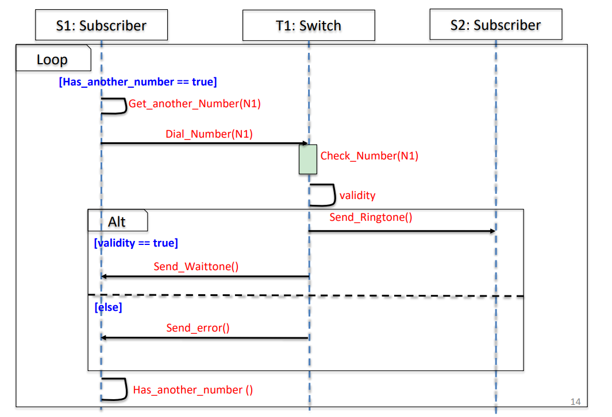
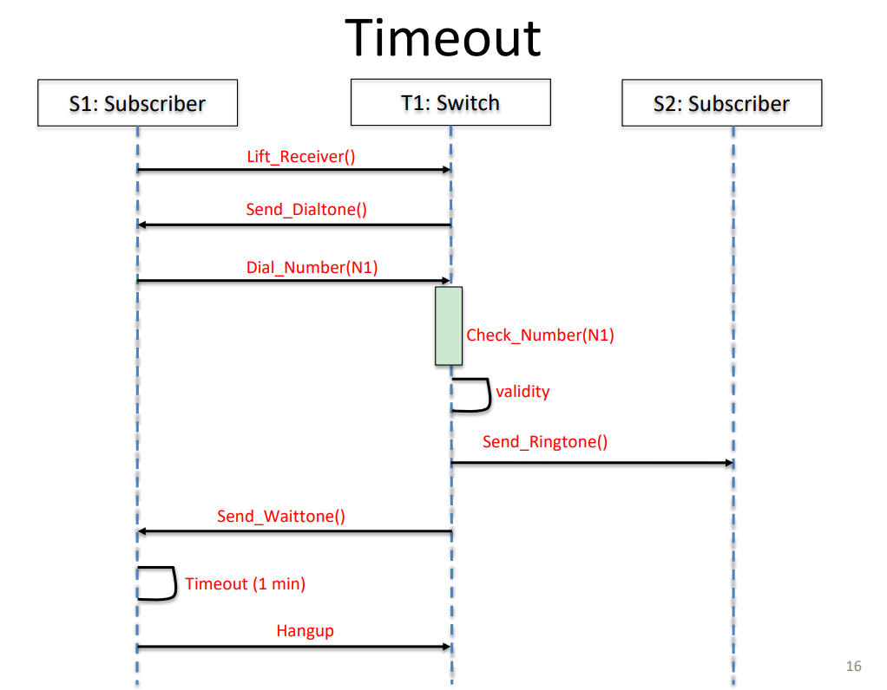
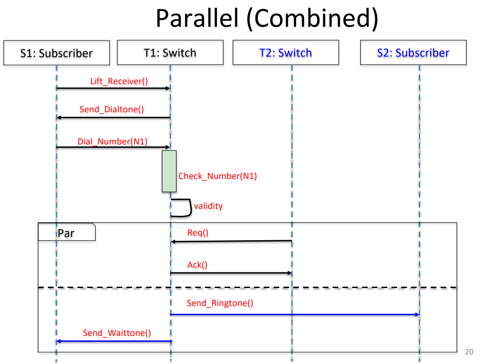

**Complements a use case** with details of workflow events.

A sequence diagram is an interaction diagram that highlights the order in which instructions are executed/messages are exchanged

- Component symbols: lifeline/activation box/option loop/alternative
- Message symbols (arrows): synch/asynchronous message

Instances of the actors are placed at the top of the diagram.

Lifelines represent either roles **or** object instances that participate in the sequence being modeled.

**Activation boxes** represent the time needed for an object to complete a task. The longer a task takes, the longer the activation box.

To show interaction, **an arrow** is drawn from the sending object to the receiving object. A **solid arrowheard** for **sync** operations, A **stick arrowhead** for **async** operations.

On the same lifeline, a higher message precedes a lower message and Message sending precedes message receiving.

An **alternative** can be used to show multiple/branching cases

A **loop** can be used to show repeating things

A **timeout** can indicate an action that only repeats after a certain interval has passed

A **parallel** can be used to indicate two things that happen simultaneously

