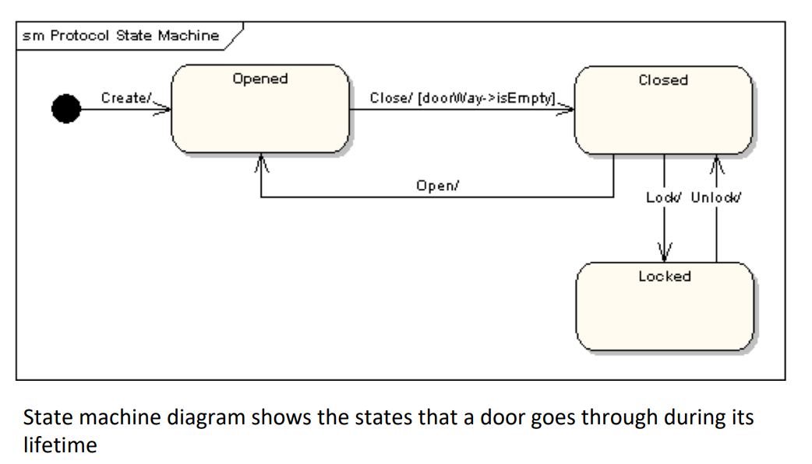

Remember Finite State Machines?

**Transitions**: from one state to another are denoted by stick arrows with a trigger on them

**Action**: what results in the transition

**Self Loops**: Self loops