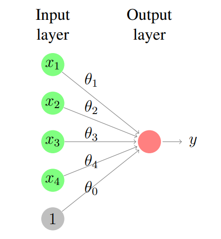

## From Logistic Regression to NNs

$h(x) = \sigma(\theta^T x + \theta_0) = \cfrac{\exp(\theta^T x + \theta_0)}{1 + \exp(\theta^T x + \theta_0)}$

Here, if $x$ is a $d$ dimensional vector, then we can imagine the input of $h$ as being a layer composed of $d$ "neurons" and the output layer being a single value $y$.

 

This resulting graph is an NN. Specifically, it is a single-layered feed-forward NN. The multipliers along the edges $\theta_i$ are called *weights*, and the $\theta_0$ the *bias*. The sum $z = \theta^T x + \theta_0$. The output $y = \sigma(z)$ where $\sigma$ is the *activation function*.

## More activation functions

1. $\sigma(z) = \cfrac{\exp(z)}{1 + \exp(z)}$ range: $(0, 1)$
2. $\tanh(z) = \cfrac{e^z - e^{-z}}{e^z + e^{-z}}$ range $(-1, 1)$
3. $\text{ReLU}(z) = \max(0, z)$ (Rectifier Linear Unit)
4. $\text{LReLU}(z) = \begin{cases} z & z > 0 \\ 0.01z & z \leq 0 \end{cases}$ (Leakey)
5. $\text{softplus}(z) = \ln(1+e^z)$
6. $\text{ELU}(z) = \begin{cases} z & z \geq 0 \\ a(e^z - 1) & z < 0 \end{cases}$ (Exponential Linear Unit)

## Deep NNs

If an NN contains > 1 hidden layers, then it is known as a deep NN.

## Back Propagation

let the weight connecting neuron $i$ in layer $k$ to neuron $j$ in the layer $k+1$ be $w_{ijk}$

The activation of $j$ $a_{j(k+1)} = \sigma\left(\sum\limits_{i = 1}^{n_k} w_{ijk}a_{ik} + b_{j(k+1)}\right) = \sigma\left(\vec{w}_{jk}^T\vec{a}_k + b_{j(k+1)}\right)$

Here, $b_{j(k+1)}$ is the bias for neuron $j$ in layer $k+1$

> $\vec{a}_{k+1} = \sigma\left(W_k \vec{a}_k + \vec{b}_{k+1}\right)$

where $W_k = \begin{bmatrix} \vec{w}_{1k}^T & ... & \vec{w}_{n_{k+1}k}^T \end{bmatrix}^T$

If we have a scalar cost function $C$, we can take the "gradient" of $C$ w.r.t. $W_k$:

$W_k^{(t+1)} = W_k^{(t)} - \eta \left(\cfrac{\partial C}{\partial W_k}\right)^T$

let us have $k$ layers (excluding the output layer) of neurons. the symbols $a, z, b$ represent vectors, while $W$ is a matrix.

The activation vector layer $i$ is $a_i = \sigma(z_{i-1})$ where $z_j = W_ja_j + b_j$ (here, the bias can be considered the weight vector for a neuron in layer $j$ which always has an activation of 1)

the output layer $\hat{y} = \sigma(z_k)$ and we have a scalar cost function $C$

computing the derivatives for gradient descent:

we define the $\delta_{\hat{y}} = \cfrac{\partial C}{\partial \hat{y}}$

WRT weight matrix

$\cfrac{\partial C}{\partial W_k} = \cfrac{\partial C}{\partial \hat{y}} \color{lime} \cfrac{\partial \hat{y}}{\partial z_k} \color{yellow} \cfrac{\partial z_k}{\partial W_k}$

$\color{lime} \cfrac{\partial \hat{y}}{\partial z_k} = (\hat{y} \odot (1 - \hat{y}) 1^T) \odot \mathbb{I}$

$\color{yellow} \cfrac{\partial z_k}{\partial W_k} = a_k$ (Note: this is a 3rd order tensor in reality, but we can use this as a trick here due to some nice simplifications that happen with the tensor)

> $\cfrac{\partial C}{\partial W_k} = \color{yellow} a_k \color{default} \cfrac{\partial C}{\partial \hat{y}} \color{lime} (\hat{y} \odot (1 - \hat{y}) 1^T) \odot \mathbb{I}$

WRT biases

$\cfrac{\partial C}{\partial b_k} = \cfrac{\partial C}{\partial \hat{y}} \color{lime} \cfrac{\partial \hat{y}}{\partial z_k} \color{orange} \cfrac{\partial z_k}{\partial b_k}$

$\color{orange} \cfrac{\partial z_k}{\partial b_k} = \mathbb{I}$

> $\cfrac{\partial C}{\partial b_k} = \cfrac{\partial C}{\partial \hat{y}} \color{lime} (\hat{y} \odot (1 - \hat{y}) 1^T) \odot \mathbb{I}$

$\color{yellow} \delta_k \color{default} = \cfrac{\partial C}{\partial \hat{y}} \color{lime} \cfrac{\partial \hat{y}}{\partial z_k} \color{cyan} \cfrac{\partial z_k}{\partial a_k}$

$\color{cyan} \cfrac{\partial z_k}{\partial a_k} = W_k$

> $\color{yellow} \delta_k \color{default} = \cfrac{\partial C}{\partial \hat{y}} \color{lime} ((\hat{y} \odot (1 - \hat{y}) 1^T) \odot \mathbb{I}) \color{cyan} W_k$

Going further back:

WRT weights

$\cfrac{\partial C}{\partial W_{k-1}} = \cfrac{\partial C}{\partial \hat{y}} \color{lime} \cfrac{\partial \hat{y}}{\partial z_k} \color{cyan} \cfrac{\partial z_k}{\partial a_k} \color{violet} \cfrac{\partial a_k}{\partial z_{k-1}} \cfrac{\partial z_{k-1}}{\partial W_{k-1}}$

$\cfrac{\partial C}{\partial W_{k-1}} = \color{yellow} \delta_k \color{violet} \cfrac{\partial a_k}{\partial z_{k-1}} \cfrac{\partial z_{k-1}}{\partial W_{k-1}}$

> $\cfrac{\partial C}{\partial W_{k-1}} = \color{violet} a_{k-1} \color{yellow} \delta_k \color{violet} (a_k \odot (1 - a_k) 1^T) \odot \mathbb{I}$

WRT Bias

$\cfrac{\partial C}{\partial b_{k-1}} = \cfrac{\partial C}{\partial \hat{y}} \color{lime} \cfrac{\partial \hat{y}}{\partial z_k} \color{cyan} \cfrac{\partial z_k}{\partial a_k} \color{violet} \cfrac{\partial a_k}{\partial z_{k-1}} \color{pink} \cfrac{\partial z_{k-1}}{\partial b_{k-1}}$

$\color{pink} \cfrac{\partial z_{k-1}}{\partial b_{k-1}} = \mathbb{I}$

> $\cfrac{\partial C}{\partial b_{k-1}} = \color{yellow} \delta_k \color{violet} (a_k \odot (1 - a_k) 1^T) \odot \mathbb{I}$

$\color{yellow} \delta_{k-1} \color{default} = \cfrac{\partial C}{\partial \hat{y}} \color{lime} \cfrac{\partial \hat{y}}{\partial z_k} \color{cyan} \cfrac{\partial z_k}{\partial a_k} \color{violet} \cfrac{\partial a_k}{\partial z_{k-1}} \color{magenta} \cfrac{\partial z_{k-1}}{\partial a_{k-1}}$

> $\color{yellow} \delta_{k-1} \color{default} = \color{yellow} \delta_k \color{violet} ((a_k \odot (1 - a_k) 1^T) \odot \mathbb{I}) \color{magenta} W_{k-1}$

Now these form recursive formulae, yippe!